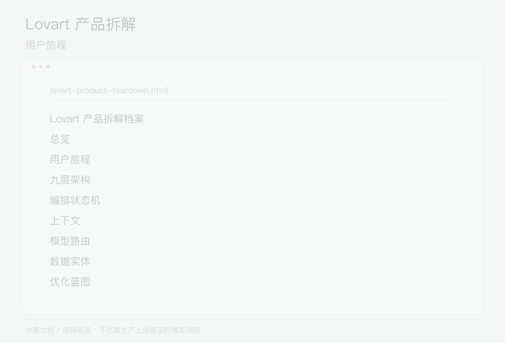

## 动态项目导览

  

[观看 / 下载完整视频](assets/demo/demo.mp4) · [素材来源](assets/demo/sources.json)

演示为仓库文档与源码的动态导览，非产品操作录屏。

# lovart-product-teardown
Lovart 设计 Agent 完整产品架构拆解：用户旅程、Agent 编排、九层架构、模型路由、数据实体与优化蓝图。
